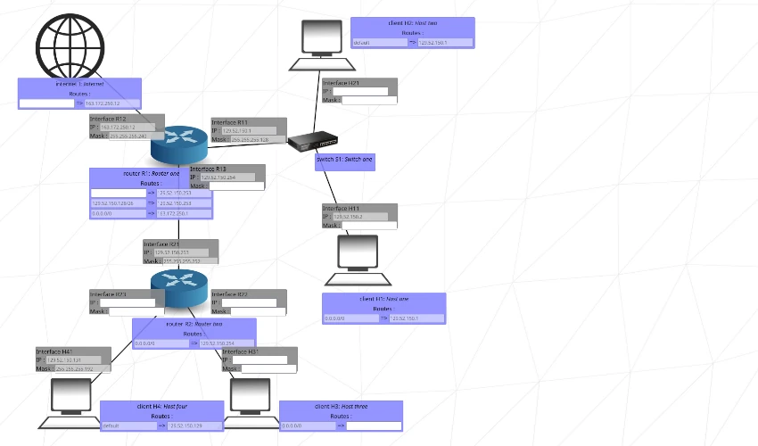

# 🧠 NetPractice

NetPractice is a network debugging and simulation exercise designed by 42. It helps students improve their understanding of IP addressing, subnetting, and routing by fixing broken networks through logical configuration and troubleshooting.

---

## 📚 Project Overview

NetPractice trains students to:

- Understand IP addresses and subnet masks  
- Identify network and broadcast addresses  
- Route between different networks  
- Debug and fix network connectivity issues  
- Design and configure simple computer networks

You will be presented with broken network setups and will need to fix them using proper IP configurations and routing logic.

---

## 🧩 Objectives

- Assign valid and consistent IP addresses and subnet masks
- Connect devices across multiple networks using routers
- Debug connectivity problems and misconfigured routes
- Apply subnetting techniques
- Understand how routing tables work

---

## 🚀 How to Use

1. Open the NetPractice interface on your 42 intranet.
2. Choose a level/exercise to work on.
3. Review the network topology and IP configurations.
4. Use the graphical interface to:
   - Edit IP addresses and subnet masks
   - Configure router interfaces
   - Add static routes where needed
   - Use `ping` to test communication between hosts
5. Click "Validate" when your network is working correctly.

---

## 🧠 Key Concepts

- **IPv4 Addressing**: Format like `192.168.1.10`
- **Subnet Mask**: Defines the range of IPs (e.g. `255.255.255.0`)
- **CIDR Notation**: Shorthand for subnet masks (e.g. `/24`)
- **Network Address**: The first IP in a subnet (e.g. `192.168.1.0`)
- **Broadcast Address**: The last IP in a subnet (e.g. `192.168.1.255`)
- **Default Gateway**: Used to send traffic outside the local network
- **Routing Table**: List of rules that determine where to send packets

---

## 🛠️ Tools in the Interface

- ✅ IP and subnet mask editor
- ✅ Router configuration with static routing
- ✅ Built-in `ping` utility for network testing

---

## 📝 Tips

- Ensure all devices on the same LAN share the same subnet
- Use routers to connect different subnets
- Every router interface needs an IP
- Test each segment before validating the full network
- Don’t forget to add return routes when routing between subnets
- Be careful with overlapping subnets or incorrect masks

---

## 📈 Learning Outcomes

After completing NetPractice, you will be able to:

- Build and troubleshoot simple IP networks
- Subnet a network and calculate ranges
- Use routing tables and understand how routers forward packets
- Set up proper default gateways for different devices
- Identify and fix typical network misconfigurations

---

## 🧩 Example Exercise

> **Goal**: Make sure PC A can ping PC B through a router.

## 👤 Author

* [Mkadri66](https://github.com/Mkadri66)

---

> Project completed as part of the 42 School curriculum.
